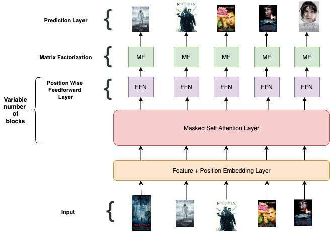
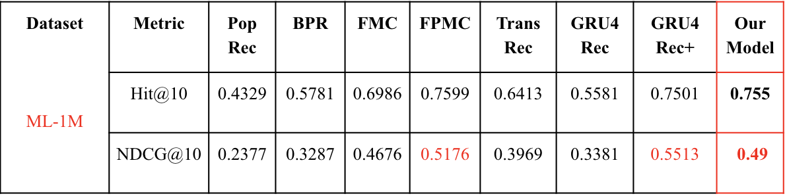
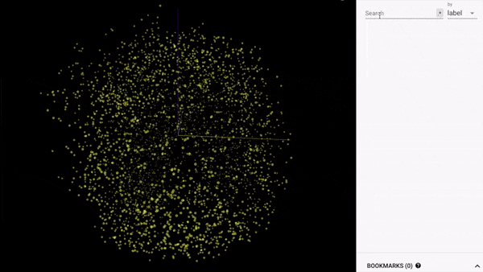

# RecNet
Session based recommendation system using state of the art Transformers and Matrix Factorization on MovieLens-1M. <br/>
Please refer to the [Report](Report.pdf) to view a detailed explanation of our project.

## Model Architecture


## Results


## Learned Item Embeddings from Scratch


## Install Dependencies

```bash
pip install -r requirements.txt
```
## Instructions to run code
- Create ```save/``` directory inside the ``./Code`` folder in order to save checkpoints
- Run ```python Code/train.py  --max_seq_len 200 --num_layers 2 ``` for the Transformer Model
- Run ```python Code/trainRNN.py  --max_seq_len 200 --num_layers 2``` for the RNN Model

## Tensorboard
```tensorboard --logdir=runs```


